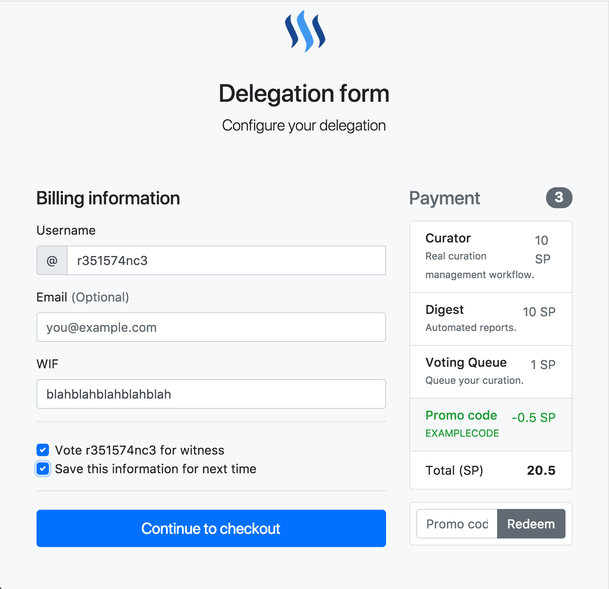
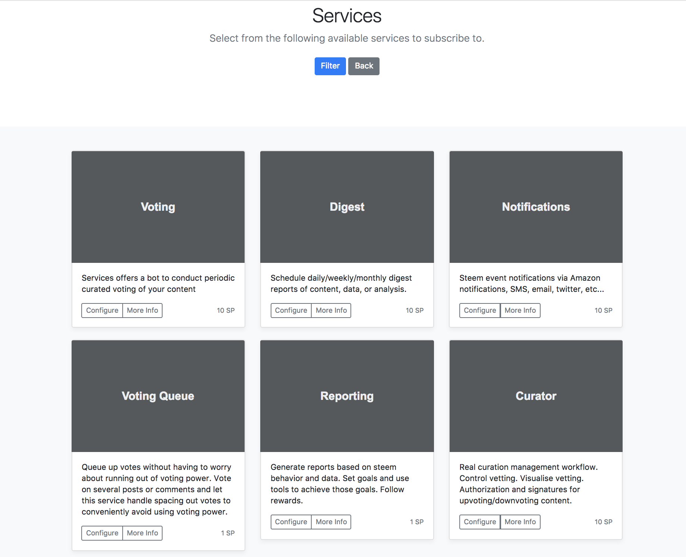
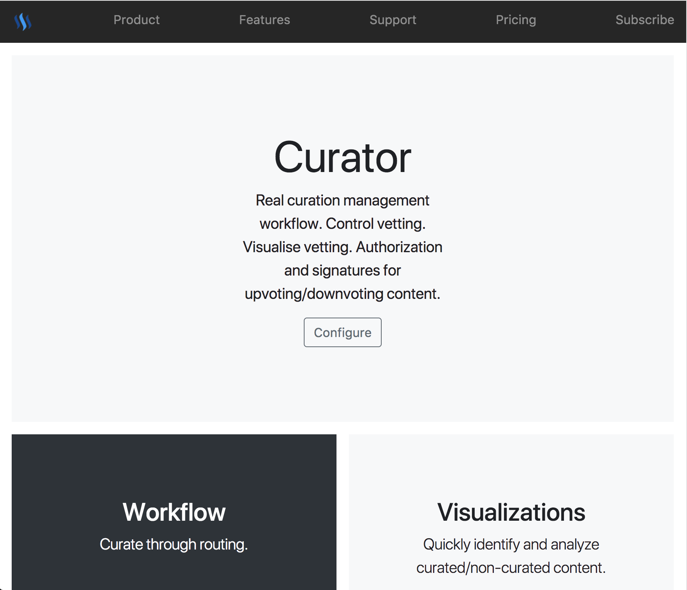
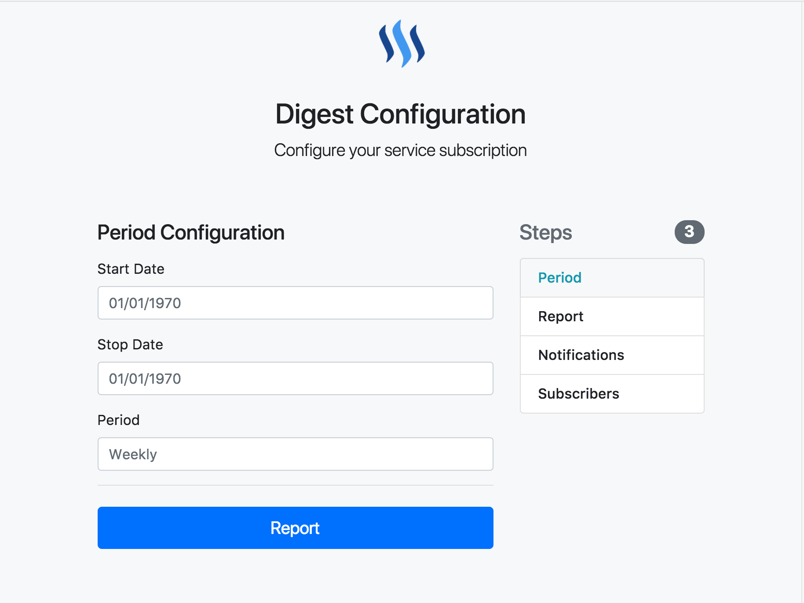
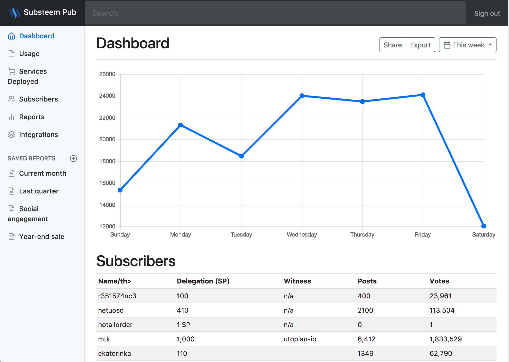
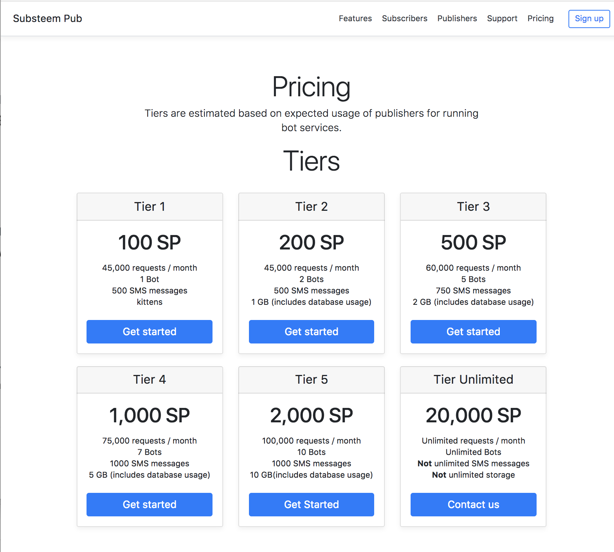

# steem-subscription-gateway
----
Site for managing subscription model for STEEM services. I am recommending a new pricing plan, paradigm, and strategy for STEEM-based services. As of now, most services are paid via SBD or STEEM.

## STEEM Power Delegation as Subscription Payment

That's right. I'm recommending a new strategy that uses SP as a means for subscription payments. Increase your subscription benefit by increasing the amount of delegation you giver. Likewise, by reducing. Want to unsubscribe? Undelegate. Once the grace period has ended, your subscription will be over. Feel free to continue use until delegation has been redeemed.

## Why subscription

Most uses are paying regular fees on a daily, weekly, or monthly basis. I'd like to take advantage of a flat plan that allows everyone to reap more rewards without actually spending money. That's right. Since you're delegating SP, you're not actually spending anything for services. Simply by delegating, your services are valuable.

An alternate way to look at it is not that you are purchasing services, but rather someone is offering you services in trade for your SP delegation. It works both ways. Both receive rewards from this. This is what it means for a mutually beneficial relationship.

## User Interface
----

List of views in the UI by use case

### Authorization/Authentication

Managed through STEEM keys same as steemconnect.

### Payment View

View of pricing/payment scale for subscriptions.

### Subscriber View

View for subscribers.

#### Subscribing to services (Service List)

List of services a subscriber can subscribe to. The subscriber can choose to learn more or to begin configuration of a service.

#### Detail Service View

When a subscriber is shopping for services and wants to know more about services to subscribe to, this is what they will see.

### Configuration View

Form for configuring services to subscribe to. When a user wants to subscribe to a service, this is what they will see.

### Publisher View

View for managing services for people to subscribe to.

> **Note** Look into how this is done

## Technology Stack
----
|Component/Library|Purpose|
|-----------------|-------|
|VueJS|Frontend templating|
|CouchDB Backend|Datastore for State/Preference information|
|Kubernetes|Cluster/Pod orchestration for bots. Each bot gets a pod and has access to backend information|
|AWS|Cloudwatch/Lambda/EC2/SQS/R53 for services, functions, and infrastructure to run K8s on|

## Multitenancy
----

Bots can request to be deployed with peristence which is a sidecar pod containing a database of their choosing (Couch, redis, elasticsearch). Bots can also gain access to general use platform status details from the local couch database.

## Fee/Payment Model
----

Subscription model follows the idea that you pay by subscribing, but subscriptions are handled through STEEM Power delegation rather than periodic payment system. By delegating to a service, the user becomes 

### For Subscribers

Subscribers play a flat fee based on what publishers want to sell content for.

### For Publishers

Publishers pay tiered subscription fees based on features and bandwidth:

#### Tier 1 (100 SP)

|Feature included|Usage Amount|
|----------------|------------|
|Bandwidth|45000 requests / month|
|Number of Bots|1 Bot|
|SMS|500 SMS messages|

#### Tier 2 (200 SP)

|Feature included|Usage Amount|
|----------------|------------|
|Bandwidth|45000 requests / month|
|Number of Bots|2 Bots|
|SMS|500 SMS messages|
|Persistent Storage|1 GB (includes use of a database)|

#### Tier 3 (500 SP)

|Feature included|Usage Amount|
|----------------|------------|
|Bandwidth|60000 requests / month|
|Number of Bots|5 Bots|
|SMS|750 SMS messages|
|Persistent Storage|2 GB (includes use of a database)|

#### Tier 4 (1000 SP)

|Feature included|Usage Amount|
|----------------|------------|
|Bandwidth|75000 requests / month|
|Number of Bots|7 Bots|
|SMS|1000 SMS messages|
|Persistent Storage|5 GB (includes use of a database)|

#### Tier 5 (2000 SP)

|Feature included|Usage Amount|
|----------------|------------|
|Bandwidth|100000 requests / month|
|Number of Bots|10 Bots|
|SMS|1000 SMS messages|
|Persistent Storage|10 GB (includes use of a database)|

#### Tier Unlimited (20000 SP)

|Feature included|Usage Amount|
|----------------|------------|
|Bandwidth|Unlimited requests / month|
|Number of Bots|Unlimited Bots|
|SMS|**Not** unlimited SMS messages|
|Persistent Storage|**Not** Unlimited storage|

> **Note** pricing must be sustainable. Pricing can change at any time that it becomes unsustainable. Please do not abuse the pricing tiers or they will become adjusted. Unlimited tier is configured such that obvious cases of abuse are avoided. Unlimited bots and requests can easily be abused, so please do not do so. Remove any bots you're not using.

# Release Date

Tenatively, I'm expecting to release this on March 1, 2018

# Feedback

Please give feedback in replies or contact me on [Discord](https://discord.gg/FMNQBZs). I am eager to know what people think of this pricing model. I am especially interested in those experience with the community to give their opinions on the effects this may/may not have on the reward system (negative or positive).